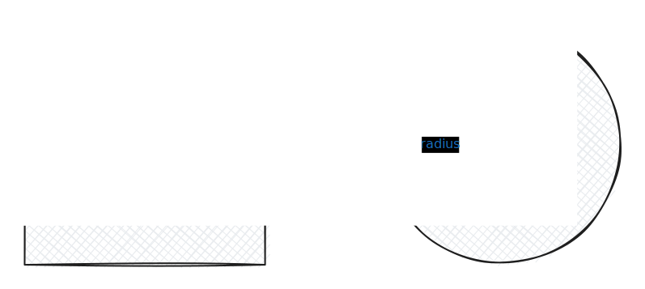

# Worm-Tracker

> A toolbox for tracking the position of multiple *C. elegans* worms in behavioral experiments.

## Table of Contents

- [0. Prerequisites](#0-prerequisites)
  - [0.1 Naming Conventions](#01-naming-conventions)
  - [0.2 Python Environment](#02-python-environment)
  - [0.3 Region of Interest (ROI)](#03-region-of-interest-roi)
  - [0.4 Correction](#04-correction)
- [1. Quick Start](#1-quick-start)
- [2. Main Features](#2-main-features)
- [3. Output Results](#3-output-results)
- [4. Advanced Usage](#4-advanced-usage)
- [5. How It Works](#5-how-it-works)

## 0. Prerequisites

### 0.1 Naming Conventions

Having a consistent and well-defined naming convention can help prevent strange bugs.

- `N2_group_X.avi`: Video recording of a behavioral experiment. `N2` indicates the *C. elegans* strain, `group` refers to the experimental group, and `X` is the plate ID.
- `date_correcting.avi`: Video for correction, dated `date`.

**Example**:
```
N2_control_1.avi    # N2 strain, control group, plate 1
N2_control_2.avi
N2_test_1.avi       # N2 strain, test group, plate 1
2024.11.04_correcting.avi  # Correction video
```

### 0.2 Python Environment

Create a Python virtual environment through `conda`:

#### Step 0: Install Anaconda or Miniconda

Make sure you have installed [Anaconda](https://anaconda.com/) or [Miniconda](https://www.anaconda.com/docs/getting-started/miniconda/main).

#### Step 1: Create Environment

Please ensure you are in the correct directory and execute the following command in your terminal (or CMD/PowerShell on Windows) to create a new environment:

```bash
conda env create -f environment.yml
```

#### Step 2: Activate Environment

```bash
conda activate worm-tracker
```

**Environment Dependencies**:
- Python 3.9
- NumPy
- OpenCV
- Plotly
- Pandas
- progressbar2
- Matplotlib

### 0.3 Region of Interest (ROI)

> [!NOTE]
> We track worms only within the region of interest (ROI) and discard any trajectories that fall outside of it.

#### 0.3.1 ROI Center

Please extract a frame from the video recording and manually mark the center of the plate with a <span style="color:red; font-weight:bold">red circle</span>, as shown below:


> [!CAUTION]
> Preserve frame resolution during extraction and annotation.

**Annotation Requirements**:
- Filename must match the video filename (only extension differs)
  - Video: `N2_control_1.avi`
  - ROI annotation image: `N2_control_1.jpg`
- Use red color (red range in HSV color space) to mark the circle
- Circle should mark the center position of the plate

#### 0.3.2 ROI Radius

The ROI radius parameter (defined as shown below) is determined by the input argument during execution of `main.py`. (Default radius is 900 pixels)

<figure style="text-align:center; margin: 0 auto;">

<em>Definition of ROI radius</em>
</figure>

**Example of Setting ROI Radius**:
```bash
python main.py --p2vs "path/to/video/folder" --radius 800
```

> [!TIP]
> ROI is actually a **rectangular region**, not circular: `[roi_x ± radius, roi_y ± radius]`

### 0.4 Correction

Run the correction program:

```bash
python utils/correcting.py --p2v "path/to/video"
```

## 1. Quick Start

### Prepare Input Files

Before starting, make sure you have:

1. **Video Files**: Place them in the same folder
   ```
   /experiment_data/2024.11.04/
   ├── N2_control_1.avi
   ├── N2_control_2.avi
   └── N2_test_1.avi
   ```

2. **ROI Annotation Images**: One jpg file for each video
   ```
   /experiment_data/2024.11.04/
   ├── N2_control_1.avi
   ├── N2_control_1.jpg  ← Red circle marking plate center
   ├── N2_control_2.avi
   ├── N2_control_2.jpg
   ├── N2_test_1.avi
   └── N2_test_1.jpg
   ```

### Run Complete Tracking Pipeline

#### Step 1: Run Detection and Initial Tracking

```bash
python main.py --p2vs "/experiment_data/2024.11.04/" --radius 900 --date "11.04"
```

This step will generate initial trajectory segments, but these segments may be fragmented.

#### Step 2: Link Trajectory Segments into Complete Worm Trajectories

Run the `find_worm.ipynb` notebook to link trajectory segments into complete worm trajectories:

1. Open `find_worm.ipynb` in Jupyter Notebook or JupyterLab
2. Modify the analysis folder path in the notebook:
   ```python
   # Specify the plate folder to analyze
   p2trackers = os.listdir("./simple_trackers_result/")
   analysis_folder = p2trackers[0]  # Or manually specify, e.g., "n2_control_1"
   ```
3. Run all cells sequentially:
   - **Part I**: Load trajectories and convert to fine-grained trajectories
   - **Part II**: Identify initial stable worms (need to determine number of worms based on visualization)
   - **Part III**: Link complete worm trajectories and save validation results

> [!IMPORTANT]
> In Part II, you need to determine the number of worms in the plate based on the visualization (worm count per frame plot), then modify:
> ```python
> all_ini = find_initial(long_dfs, 10, new_summarize)  # 10 is the number of worms
> ```

### View Results

After processing is complete, you will find results in the following locations:

**Step 1 (`main.py`) Intermediate Results**:
```
simple_trackers_result/
├── n2_control_1/
│   ├── trackers.json      # Initial trajectory segments
│   ├── long_dfs.csv        # Per-frame detection results
│   └── centroids.txt       # ROI center coordinates
├── n2_control_2/
│   └── ...
└── n2_test_1/
    └── ...
```

**Step 2 (`find_worm.ipynb`) Final Results**:
```
final_results/
├── n2_control_1/
│   ├── csvs/
│   │   ├── worms_0.csv    # Complete trajectory of worm 0
│   │   ├── worms_1.csv    # Complete trajectory of worm 1
│   │   └── ...
│   └── imgs/              # Visualization images (if generated)
├── n2_control_2/
│   └── ...
└── n2_test_1/
    └── ...
```

## 2. Main Features

### 2.1 Core Pipeline

Worm-Tracker consists of four main stages:

```
Video Files → [1.Detection] → Per-frame CSV → [2.Initial Tracking] → Trajectory Segments → [3.Trajectory Linking] → Complete Trajectories → [4.Analysis]
```

- **Stage 1 (Detection)**: Detect worm positions in each frame using background subtraction
- **Stage 2 (Initial Tracking)**: Generate initial trajectory segments using IoU algorithm (`main.py`)
- **Stage 3 (Trajectory Linking)**: Link fragmented trajectory segments into complete worm trajectories (`find_worm.ipynb`)
- **Stage 4 (Analysis)**: Perform downstream analysis on complete worm trajectories

### 2.2 Command Line Arguments

#### Required Arguments

| Argument | Description | Example |
|----------|-------------|---------|
| `--p2vs` | Directory path containing videos | `"/data/2024.11.04/"` |

#### Optional Arguments

| Argument | Default | Description |
|----------|---------|-------------|
| `--radius` | 900 | ROI radius (pixels) |
| `--date` | Current date | Date string (format: MM.DD) |
| `--pool` | 4 | Number of parallel processes |
| `--p2det` | `./detect_results` | Detection results output path |
| `--p2trackers` | `./simple_trackers_result` | Tracking results output path |
| `--vis` | false | Show visualization during processing |
| `--img` | false | Save annotated frame images |
| `--video` | false | Save annotated video output |

### 2.3 Usage Examples

**Basic Usage**:
```bash
python main.py --p2vs "/data/videos/"
```

**Custom ROI and Date**:
```bash
python main.py --p2vs "/data/videos/" --radius 850 --date "11.10"
```

**Save Visualization Results**:
```bash
python main.py --p2vs "/data/videos/" --video true --img true
```

**Adjust Parallel Processing**:
```bash
python main.py --p2vs "/data/videos/" --pool 8
```

## 3. Output Results

### 3.1 Directory Structure

```
project_root/
├── detect_results/              # Intermediate results from detection stage
│   └── n2_control_1_11.04/
│       ├── csv/                 # Per-frame detection data (deleted after processing)
│       ├── centroids.txt        # ROI center coordinates
│       └── sample_img_*.jpg     # Random sampled frame images
│
├── simple_trackers_result/      # Initial tracking results (main.py output)
│   └── n2_control_1/
│       ├── trackers.json        # Initial trajectory segments
│       ├── long_dfs.csv         # Complete detection data
│       └── centroids.txt        # ROI center coordinates
│
└── final_results/               # Final tracking results (find_worm.ipynb output)
    └── n2_control_1/
        ├── csvs/
        │   ├── worms_0.csv      # Complete trajectory of worm 0
        │   ├── worms_1.csv      # Complete trajectory of worm 1
        │   └── ...
        └── imgs/                # Visualization images (if generated)
```

### 3.2 Output File Descriptions

#### main.py Output Files

##### trackers.json

Contains information about all initially detected trajectory segments:

```json
{
  "0": {
    "start_frame": 100,
    "end_frame": 500,
    "bboxes": [[x, y, w, h], ...],      // Bounding box for each frame
    "centroids": [[cx, cy], ...]         // Centroid coordinates for each frame
  },
  "1": {
    "start_frame": 105,
    "end_frame": 480,
    ...
  }
}
```

**Field Descriptions**:
- `start_frame`: Frame number where trajectory starts
- `end_frame`: Frame number where trajectory ends
- `bboxes`: List of bounding boxes, format `[x, y, width, height]`
- `centroids`: List of centroid coordinates, format `[x, y]`

> [!NOTE]
> These are initial trajectory segments that may be fragmented and need further processing through `find_worm.ipynb`.

##### long_dfs.csv

Raw detection data for each frame:

| Column | Description |
|--------|-------------|
| `frame` | Frame number |
| `x`, `y` | Top-left corner coordinates of bounding box |
| `w`, `h` | Width and height of bounding box |
| `cX`, `cY` | Centroid coordinates |

##### centroids.txt

ROI center coordinates, format: `[x, y]`

Example: `[960, 540]`

#### find_worm.ipynb Output Files

After running `find_worm.ipynb`, the following final result files will be generated in the `final_results/{subj}/` folder:

##### csvs/worms_{i}.csv

Complete trajectory data for each valid worm, one CSV file per worm.

**Column Descriptions**:
| Column | Description |
|--------|-------------|
| `frames` | Frame number |
| `trackers_id` | Tracker ID used (or "interpolated" for interpolated frames) |
| `x`, `y` | Worm centroid coordinates |

**Features**:
- Each worm's trajectory is linked from multiple tracker segments
- Contains complete start/end frame information and position data
- Missing frames are filled by linear interpolation
- Only retains valid worms that pass validation (meeting duration, position, and other conditions)

##### imgs/ (Optional)

If enabled in `write_results()`, trajectory visualization images for each worm will be generated.

> [!TIP]
> These are the final analysis results that can be directly used for downstream behavioral analysis and statistics. Final results are saved in the `final_results/` directory.

## 4. Advanced Usage

### 4.1 Run Detection Only

If you only want to run the detection stage:

```python
from detector.concat_videos import find_all_videos
from detector.detector import detect

# Find all videos
videos = find_all_videos("/path/to/videos/")

# Detect single video
detect(videos[0], "./detect_results", radius=900, vis=False,
       imgs=False, video=False, date="11.04")
```

### 4.2 Run Tracking Only

If you already have detection results and only want to run tracking:

```python
from tracker.iou import simple_iou_tracker
import pandas as pd

# Load detection results
all_dfs = [pd.read_csv(f"frame_{i}.csv") for i in range(1, 1001)]

# Run tracking
trackers = simple_iou_tracker(all_dfs, t_min=10, sigma_iou=0.3)
```

**Parameter Descriptions**:
- `t_min`: Minimum trajectory length (frames), trajectories shorter than this will be discarded
- `sigma_iou`: IoU threshold for determining if objects in two frames are the same worm

### 4.3 Detailed Trajectory Linking Usage

Manually adjust parameters in `find_worm.ipynb` to achieve best results:

#### Step 1: Load and Visualize

```python
# Load trajectory data
all_trackers, long_dfs, centroid = load_subj('simple_trackers_result', analysis_folder)
new_trackers, new_summarize = trackers2fine(all_trackers, long_dfs)

# Visualize worm count per frame
long_dfs.groupby('frame').size().plot()
```

Determine the number of worms in the plate based on the visualization (take the highest point value).

#### Step 2: Identify Initial Worms

```python
# Second parameter is number of worms, adjust based on visualization from previous step
all_ini = find_initial(long_dfs, 10, new_summarize)  # 10 is the number of worms
ini_indx = all_ini.sort_values(by='start_frame').tracker_id.values
```

#### Step 3: Link and Validate

```python
# Link complete trajectories
worms = find_worms(ini_indx, new_summarize)

# Validate worm trajectories
# Parameter descriptions:
# - 870: ROI radius (should match --radius parameter in main.py)
# - start_frame=600: Worms must start before this frame (filters late-appearing worms)
valid_worms = diagnosis_worms_square(worms, new_summarize, centroid,
                                     long_dfs, 870, start_frame=600)

# Save results
write_results(analysis_folder, valid_worms, new_trackers, centroid, 900, shape='square')
```

**Key Parameter Adjustments**:
- Second parameter of `find_initial()`: Number of worms in the plate
- `radius` parameter of `diagnosis_worms_square()`: ROI radius, should match `--radius` in `main.py`
- `start_frame` parameter of `diagnosis_worms_square()`: Worms must start before this frame to be considered valid

### 4.4 Batch Process Multiple Dates

```bash
#!/bin/bash
dates=("11.04" "11.05" "11.06")
for date in "${dates[@]}"; do
    python main.py --p2vs "/data/2024.${date}/" --date "${date}"
done
```

### 4.5 Extract Video Frames

```bash
python utils/extract_img.py
```

### 4.6 Detect ROI Circle

Test ROI detection functionality separately:

```bash
python utils/detect_circle.py
```

Modify the `image_path` variable in `detect_circle.py` to specify the image path.

## 5. How It Works

### 5.1 Detection Algorithm

**Steps**:

1. **Background Subtraction**: Use KNN background subtractor to detect moving objects
   ```python
   cv2.createBackgroundSubtractorKNN(history=3500, dist2Threshold=80)
   ```

2. **Morphological Operations**: Use 3×3 elliptical kernel for opening and closing operations to remove noise

3. **Contour Detection**: Find all contours and filter
   - Area range: 5-250 pixels
   - Corresponds to typical worm size

4. **Feature Extraction**: Calculate for each detected worm:
   - Bounding box `(x, y, w, h)`
   - Centroid coordinates `(cX, cY)`

### 5.2 Tracking Algorithm

Uses **Simple IoU (Intersection over Union) Tracking** algorithm:

1. **Initialization**: All detections in the first frame create new trajectories

2. **Frame-to-Frame Matching**: For each new frame:
   - Calculate IoU between current detections and previous frame trajectories
   - Choose match with maximum IoU (greedy strategy)
   - If IoU ≥ threshold (default 0.3), continue trajectory
   - Otherwise create new trajectory

3. **Trajectory Termination**: Trajectories that cannot be matched are terminated

4. **Post-processing**: Filter out short trajectories with length < `t_min` (default 10 frames)

**Advantages**:
- Simple and efficient
- No training required
- Suitable for scenarios where worm movement speed is relatively slow

**Limitations**:
- May produce ID switches when worms overlap
- Not suitable for high-speed movement or frequent crossing scenarios
- Generated trajectories may be fragmented segments

### 5.3 Trajectory Linking Algorithm

The trajectory linking algorithm (implemented in `find_worm.ipynb`) is used to link fragmented trajectory segments generated by IoU tracking into complete worm trajectories.

**Main Steps**:

1. **Trajectory Refinement** (`trackers2fine()`):
   - Convert raw trackers to a more refined data structure
   - Generate trajectory summaries (start frame, end frame, frame count, etc.)

2. **Identify Initial Worms** (`find_initial()`):
   - Identify initial stable trajectories based on frame coverage and stability
   - Return list of initial trackers most likely representing real worms
   - Requires specifying number of worms in the plate

3. **Trajectory Linking** (`find_worms()`):
   - Starting from initial trackers, search forward and backward for possible connections
   - Determine if two trackers belong to the same worm based on temporal and spatial distance
   - Construct complete worm trajectory paths

4. **Trajectory Validation** (`diagnosis_worms_square()`):
   - Check validity of worm trajectories:
     - Start time requirement (`start_frame` parameter)
     - End time requirement (must track to end of video)
     - ROI boundary constraints (trajectories cannot be too close to boundaries)
   - Filter out trajectories that don't meet requirements

5. **Result Saving** (`write_results()`):
   - Save complete trajectories of valid worms
   - Generate statistical information files

**Advantages**:
- Solves ID switching problem of simple IoU tracking
- Generates longer, more stable trajectories
- Ensures trajectory quality through validation steps

**Parameter Tuning Suggestions**:
- If worm count identification is inaccurate, adjust visualization interpretation or worm count parameter in `find_initial()`
- If too few valid worms, lower `start_frame` requirement or adjust ROI radius
- If trajectory linking effect is poor, may need to adjust distance threshold in `find_worms()`

### 5.4 ROI Detection Principle

**Red Circle Detection Process**:

1. **Color Space Conversion**: BGR → HSV

2. **Color Masking**: Extract red regions
   - Low red range: `[0, 100, 100]` to `[10, 255, 255]`
   - High red range: `[160, 100, 100]` to `[179, 255, 255]`

3. **Denoising**: Gaussian blur (9×9 kernel)

4. **Hough Circle Detection**: Detect circles
   ```python
   cv2.HoughCircles(blurred_mask, cv2.HOUGH_GRADIENT,
                    dp=1, minDist=50, param1=50, param2=30,
                    minRadius=5, maxRadius=200)
   ```

5. **Return Center**: Center coordinates of detected circle

## Frequently Asked Questions

### Q1: Why aren't worms being detected?

**Possible Causes**:
1. ROI annotation file is missing or naming doesn't match
2. ROI radius is set improperly
3. Video contrast is too low
4. Worms are too small or too large (not in 5-250 pixel range)

**Solutions**:
- Check if `.jpg` file exists and is named correctly
- Adjust `--radius` parameter
- Try adjusting background subtractor parameters in `detector.py`

### Q2: What if trajectories are frequently interrupted?

**Possible Causes**:
- IoU threshold is too high
- Worm movement speed is too fast

**Solutions**:
- Lower `sigma_iou` parameter (modify in `tracker/simple_tracking.py`)
- Lower `t_min` parameter to retain more short trajectories

### Q3: How to improve processing speed?

**Methods**:
1. Increase number of parallel processes: `--pool 8`
2. Turn off visualization: `--vis false`
3. Don't save intermediate images: `--img false --video false`

### Q4: Where are the output files?

**Locations**:
- Detection intermediate results: `./detect_results/`
- Initial tracking results: `./simple_trackers_result/` (can be customized via `--p2trackers` parameter)
- Final worm trajectories: `./final_results/` (generated after running `find_worm.ipynb`)

### Q5: What if too few valid worms are found in find_worm.ipynb?

**Possible Causes**:
1. `start_frame` parameter is set too strictly
2. ROI radius parameter doesn't match actual
3. Worm count parameter is set inaccurately

**Solutions**:
- Increase `start_frame` parameter value in `diagnosis_worms_square()` (e.g., change from 600 to 1000)
- Ensure `radius` parameter in `diagnosis_worms_square()` matches `--radius` in `main.py`
- Check visualization, re-confirm worm count parameter in `find_initial()`
- Lower strictness of validation conditions

### Q6: How to determine how many worms are in the plate?

**Method**:

In Part I of `find_worm.ipynb`, run:

```python
long_dfs.groupby('frame').size().plot()
```

This generates a plot of detected worm count per frame. Take the value at the **highest point** as the number of worms in the plate.

**Note**:
- If the highest point is unstable (fluctuates greatly), take the average highest value during the stable phase
- This number will be used in the `find_initial()` function in Part II

### Q7: Why aren't some worm trajectories being linked?

**Possible Causes**:
1. Time or spatial gap between trajectory segments is too large
2. Initial worm identification is inaccurate
3. Worm appearance or disappearance timing in video is inappropriate

**Solutions**:
- Check and adjust distance threshold parameters in `find_worms()` function
- Re-examine visualization to ensure worm count parameter is correct
- Lower validation conditions in `diagnosis_worms_square()`
- Check video quality to ensure worms are visible throughout recording period

## Technical Support

If you have questions or suggestions, please contact us through:

- Submit an Issue
- Review code documentation
- Read `CLAUDE.md` for more technical details

## License

Please add license information as appropriate.
